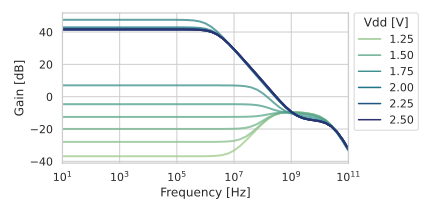

#   ZC Plot

**ZC Plot** is an application for plotting Cadence CSV outputs from
**waveforms** (or groups of waveforms, or even multiple series of groups),
**Maestro summary** data, or just plain **raw CSV files**.

ZC Plot is written in Rust and uses the [**Charming** visualization
library](https://github.com/yuankunzhang/charming).  Configuring plots is done
through a simple text file.

ZC Plot was born from a jenky set of Python scripts I wrote for interfacing with
[**Seaborn**](https://seaborn.pydata.org/), and those scripts are still
available on the `Python` branch of this repository.





Plots generated from one simple command!

##  Installation

```
cargo install
```

Directions under construction.  This application has been tested with Linux
6.10.9 and cargo 1.81.0.  Please report (or fix!) any problems with other
operating systems or system configurations.

##  Usage

If plotting waveforms, select all the waves in the waveform viewer and export
your data as a `.csv` file.  Make sure to enable the "Interpolate" option for
transient simulations so each waveform has the same time axis.  

If plotting summary data, simply press "Export data" on the Results > Detail
page in Maestro.

Then, invoke the main script as follows:

```
Usage: zc_plot [OPTIONS] <CONFIG> <PATH>

Arguments:
  <CONFIG>  
  <PATH>    

Options:
  -d, --dtype <DTYPE>  [default: wave]
  -e, --export <EXPORT>
  -i, --interact       
  -q, --quiet          
  -h, --help           Print help
  -V, --version        Print version
```

`CONFIG` is a line-delimited file that describes the desired plot (see below),
and lines starting with `#` will be treated as comments. Alternatively, using
**interactive mode** (`-i` or `--interact`) previews the parsed data and opens
an editor, and any additional configuration will then be saved to `CONFIG`.

The `-e` or `--export` switch saves the parsed data into a plain CSV file for
use in other applications.

### Configuration

Configuration files are plaintext key/value pairs, separated with a semicolon.
Lines beginning with `#` are ignored. Below is a list of all configuration
options:

### File

| Keyword | Type | Default | Description | Implemented |
|---------|------|---------|-------------|-------------|
| `filetype` | str | `svg` | Change file type.  Supports HTML, SVG, PNG, JPEG, GIF, WEBP, PNM, TIFF, TGA, DDS, BMP, ICO, HDR, OPENEXR, FARBFELD, AVIF, and QOI | |
| `filename` | str | automatic | Change output file name. | |

### Data

| Keyword | Type | Default | Description | Implemented |
|---------|------|---------|-------------|-------------|
| `x` | str | first column  | Change data used for x. | |
| `y` | list | second column | Change data used for y. | |
| `hue` | str | none | Change data used for hue. | |
| `style` | str | none | Change data used for style. | |
| `size` | str | none | Change data used for style. | |
| `xscale` | float | `1` | Rescale x-axis. | |
| `yscale` | float | `1` | Rescale y-axis. | |
| `hscale` | float | `1` | Rescale hue. | |
| `sscale` | float | `1` | Rescale size. | |

### Figure

| Keyword | Type | Default | Description | Implemented |
|---------|------|---------|-------------|-------------|
| `figsize` | tuple | `6,3` | Change figure size. | |
| `xlabel` | str | x column | Change x-axis label. | |
| `ylabel` | str | y column | Change y-axis label. | |
| `ltitle` | str | automatic | Change legend title. | |
| `theme` | str | `default` | Change plot theme. | |
| `logx` | bool | `false` | Enable/disable log for x-axis. | |
| `logy` | bool | `false` | Enable/disable log for y-axis. | | 
| `xlim` | tuple | full range | Change x-axis limits. | | 
| `ylim` | tuple | full range | Change y-axis limits. | |

### Drawing 

| Keyword | Type | Default | Description | Implemented |
|---------|------|---------|-------------|-------------|
| `width` | float | depends | Change marker or line width. | |
| `alpha` | float | `0.75` | Change drawing opacity. | |
| `palette` | str | | Change color palette. | |
| `series` | str | `line` | Change plot type.  Options include `line`, `bar`, `box`, `candlestick`, `funnel`, `gauge`, `graph`, `heat`, `parallel`, `pie`, `radar`, `sankey`, `scatter`, `sunburst`, `tree`. | |

### Help! It doesn't work!

Yeah, well, it's extremely jenky software, so do temper your expectations.  I
recommend checking the logfile to make sure you have configured the plot
correctly and chosen the right data ingest type.  Remember that failing to
specify additional plot dimensions (i.e. hue, size, and style) will cause your
data to be flattened to two dimensions. The logfile also includes a
representation of the internal data, which you can check for oddities.

You can also post an issue on the GitHub page.  If you do so, please include the
**input file**, **log file**, and any **error messages** (printed to `stderr`).
