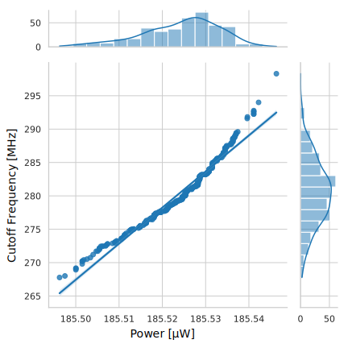
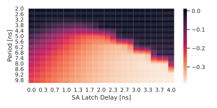

#   ZC Plot, a Cadence Plotting Utility

_Zephan M. Enciso_  
_Intelligent MicroSystems Lab_





Plots generated from one simple command!

##  Dependencies

These utilities have been tested with Linux 4.18.0 and the following software
versions:
  - `python` >= 3.9.7
  - `matplotlib` == 3.5.1
  - `jedi` == 0.18.1
  - `scipy` == 1.8.0
  - `numpy` == 1.22.2
  - `pandas` == 1.4.0
  - `seaborn` == 0.11.2

This project is _theoretically_ OS-insensitive, but unforeseen issues might
arise.  Please report (or fix!) any problems with non-Linux operating systems.

##  Usage

This script supports plotting **waveforms** (or groups of waveforms, or even
multiple series of groups), **Maestro summary data** (with the `-s` or
`--summary` switch), or any **raw CSV file** (with the `-r` or `--raw` switch).
If plotting waveforms, select all the waves in the waveform viewer and export
your data as a `.csv` file.  Make sure to enable the "Interpolate" option so
each waveform has the same time axis.  Then, invoke the main script as follows:

```
./zc_plot.py [options] PLOT INPUT [kwargs]
    -h  --help      [PLOT]  Display this message or usage for PLOT
    -k  --kwargs     FILE   Load additional external kwargs from FILE
    -x  --export     FILE   Exports the current kwargs to FILE
    -l  --log        FILE   Change default logfile name (or 'none' to disable)
    -s  --summary           Feed in summary data instead of a waveform
    -r  --raw               Feed in a raw .csv file instead of a waveform
    -i  --interact          View data ingest before setting kwargs
    -q  --quiet             Surpress verbose output
    -v  --version           Print version string

List of available PLOTs:
    inputrefnoise
    replot
    gmid
    etc. etc. etc.

INPUT must be a valid CSV, e.g. `data/my_data.csv`.
```

Kwargs can also be loaded from an external file by using the `-k` or `--kwargs`
switch.  This file must be **line-delimited** and lines starting with `#` will
be treated as comments.  When using an external file, any CLI kwargs will always
be **appended after the external kwargs**.

Alternatively, using **interactive mode** (`-i` or `--interact`) previews the
parsed data and opens a kwarg editor.  This is especially powerful when combined
with the `-x` or `--export` switch, which saves the current kwargs to a
properly-formatted text file.

> _Pro tip:_ The `csv_dump` function turns this tool into a Cadence-to-csv
> parser.

### Replot

The most versatile of the plotting functions is `replot`, which accepts either a
waveform **or** summary data **or** a raw CSV and plots arbitrary axes. `replot`
supports several Seaborn plot styles, including lineplots, scatterplots,
histograms, kde plots, and even some combinations (like histograms with kde,
invoked with any string that contains both `hist` _and_ `kde`). Jointplots are
also supported; you can include the type of the jointplot in `ptype` (e.g.
`jointkde`, `hexjoint`). Heatmaps are in beta support.  Most of the Seaborn
settings are exposed with the kwargs listed below:

```
./cadence_plot.py replot [options] INPUT [kwargs]

Data
    x=str                       Change x (default: first column)
    y=list                      Change y (default: second column)
    hue=str         h=str       Specify hue (WARNING default: None)
    style=str       s=str       Specify style (default: None)
    size=str                    Specify size (default: None)
    xscale=float    xs=float    Rescale x axis (default: 1)
    yscale=float    ys=float    Rescale y axis (default: 1)
    hscale=float    hs=float    Rescale hue (default: 1)
    sscale=float    ss=float    Rescale style (default: 1)
Figure
    figsize=tuple   fs=tuple    Change figsize (default: '6,3')
    xlabel=str      xl=str      Change x axis label (default: x)
    ylabel=str      yl=str      Change y axis label (default: y)
    ltitle=str      lt=str      Change legend title (default: automatic)
    axes=str        ax=str      Change axes style (default: 'whitegrid')
    context=str     cx=str      Scale plot elements (default: 'notebook')
    logx=bool       lx=bool     Enable/disable log for x-axis (default: False)
    logy=bool       ly=bool     Enable/disable log for y-axis (default: False)
    bbox=bool       bb=bool     Enable/disable bbox for legend (default: True)
    xlim=tuple                  Change xlim (default: full range)
    ylim=tuple                  Change ylim (default: full range)
Drawing
    width=float     w=float     Change marker or line width (default: Depends)
    alpha=float     a=float     Change alpha (default: 0.5)
    palette=list    c=list      Palette, accepts cubehelix (default: 'crest')
    ptype=str       pt=str      Change the plot type (default: 'line')
    ci=float                    Change confidence interval size (default: 95)
    stat=str                    Change stat/estimator (default: Depends)
    bins=int                    Change number of bins/levels (default: 10)
    fill=bool                   Enable/disable fill (default: Depends)
    multiple=str                Change multiple behavior (default: 'layer')
File
    filetype=str    ft=str      Change filetype (default: 'svg')
    filename=str    fn=str      Custom filename (default: automatic)
```

### Help! It doesn't work!

Yeah, well, it's extremely jenky software, so do temper your expectations.  I
recommend checking the logfile to make sure you have set the args and kwargs
correctly and chosen the right data ingest type.  Remember that failing to
specify additional plot dimensions (i.e. hue, size, and style) will cause your
data to be flattened to two dimensions. The logfile also includes a
representation of the internal DataFrame, which you can check for oddities.

You can also post an issue on the GitHub page.  If you do so, please include the
**input file**, **log file**, and any **error messages** (printed to `stderr`).


##  Writing Additional Plot Functions

Each new plot function should be defined in a different file in the
`plot_functions` directory.  This file must have a function called `plot` with
two mandatory arguments: `df`, the input Pandas DataFrame, and `kwargs`, which
is a list of additional arguments passed to the function.  This file must also
have a function called `usage` with no arguments.

```python
# Other function defs here

def usage():
    print('Interesting things about this program')

def plot(df, kwargs):
    sns.lineplot(...)
```

It is also possible to **call other plot functions**.  For example, using
`replot` is a convenient way to draw plots without re-parsing the kwargs.  When
there are duplicate kwarg definitions, the last one is used.

```python
from plot_functions import replot

df_new = # Some DataFrame transformations here
kwargs += ['hue=my_new_metric', 'ptype=scatter']

replot.plot(df_new, kwargs)
```

Each plot function will also be given the kwarg `time`, which is an execution
timestamp in ISO format generated by the main `cadence_plot.py` script.

It is **recommended**, though not required, to expect each additional argument
to be of the form `key=value`, which makes parsing the `kwargs` trivial.  For
example:

```
./cadence_plot.py replot path/to/data.csv filetype=png logx=true hue=Vov
```

```python
kwargs = ['filetype=png', 'logx=true', 'hue=Vov']

param = dict(
    # Default values
    )

for arg in kwargs:
    key, value = arg.split('=')
    param[key] = value

```
